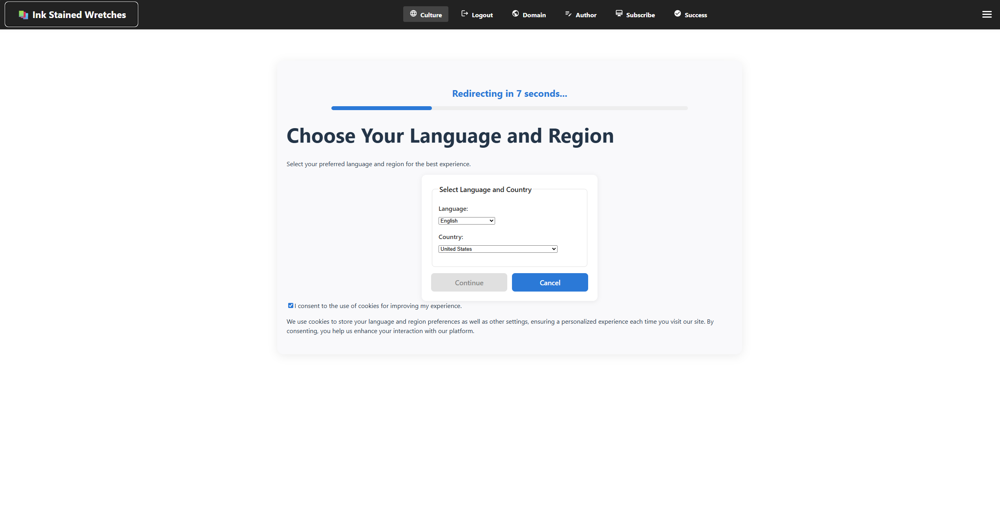

# Ink Stained Wretch

A modular, type-safe author platform built with React, TypeScript, and Vite. It supports subscription checkout with Stripe, multi-language localization, responsive design, and telemetry via Microsoft Application Insights.

## Demo Video

[](https://youtu.be/RgZER2OMr1U)

## Table of Contents

- [Overview](#overview)
- [Key Features](#key-features)
- [Tech Stack](#tech-stack)
- [Recent Updates](#recent-updates-2025)
- [Getting Started](#getting-started)
- [Project Structure](#project-structure)
- [Environment Configuration](#environment-variables)
- [Localization](#localization)
- [API Documentation](#api-documentation)
- [Stripe Integration](#stripe-integration)
- [Testing](#testing)
- [Deployment](#deployment)
- [Contributing](#contributing)
- [Troubleshooting](#troubleshooting)
- [License](#license)

## Overview

Ink Stained Wretch is a comprehensive author platform that enables writers to manage their digital presence, publish content, and monetize through subscription services. The platform provides a complete solution for author websites with integrated payment processing, multi-language support, and extensive customization options.

## Key Features

### Core Platform Features
- **Modern Architecture**: React 19 + TypeScript + Vite with strict typing and modular design
- **State Management**: Robust state management with typed reducers and custom hooks
- **Responsive Design**: Mobile-first responsive UI with reusable components
- **Real-time Updates**: Live data synchronization and optimistic UI updates

### Content Management
- **Author Profiles**: Comprehensive author profile management with headshots and biographical information
- **Book Management**: Full book catalog management with cover images and descriptions
- **Article Publishing**: Integrated article publishing and management system
- **Image Hosting**: Secure image uploads with tier-based storage limits

### Subscription & Monetization
- **Stripe Integration**: Secure subscription checkout with embedded or redirect flows
- **Tiered Plans**: Multiple subscription tiers with different feature sets and limits
- **Payment Processing**: PCI-compliant payment handling through Stripe Checkout
- **Subscription Management**: Complete subscription lifecycle management

### Internationalization & Accessibility
- **Multi-language Support**: Full i18n support with 5 built-in locales
- **RTL Support**: Right-to-left language support for Arabic
- **Accessibility**: WCAG 2.1 compliant components and interactions
- **Culture-aware Components**: Localized date, currency, and number formatting

### Integration & APIs
- **Microsoft Entra ID**: Secure authentication with Azure AD/Entra ID
- **External APIs**: Integration with Open Library, Google Books, and Penguin Random House
- **Domain Registration**: Integrated domain registration and management
- **Telemetry**: Application Insights integration for monitoring and analytics

## Tech Stack

### Frontend
- **React 19**: Latest React with concurrent features and improved performance
- **TypeScript**: Strict typing for enhanced developer experience and code quality
- **Vite 7**: Lightning-fast build tool with HMR and optimized bundling
- **MUI (Material-UI)**: Comprehensive React component library
- **React Testing Library**: Testing utilities for component testing
- **Vitest**: Fast unit testing framework

### Backend Integration
- **Microsoft Entra ID (MSAL)**: Authentication and authorization
- **Stripe**: Payment processing and subscription management
- **Azure Functions**: Serverless backend endpoints
- **Azure Blob Storage**: Image and asset storage

### Development & Deployment
- **ESLint**: Code linting and style enforcement
- **Application Insights**: Telemetry and performance monitoring
- **PowerShell Scripts**: Automated development and deployment workflows

## Recent Updates (2025)

### UI/UX Improvements
- ✅ Subscribe and Checkout pages fully localized across all supported languages
- ✅ Book descriptions with configurable truncation limits and ellipsis
- ✅ Enhanced responsive `Container` component with improved mobile layouts
- ✅ Stripe checkout UI improvements with loading states and progress indicators
- ✅ Error boundaries and user-friendly error pages

### Performance & Features
- ✅ Environment-driven subscription plan pagination
- ✅ Optimized component rendering and state management
- ✅ Improved image loading and caching strategies
- ✅ Enhanced telemetry and analytics integration

## Getting Started

### Prerequisites

- **Node.js 18+**: Download from [nodejs.org](https://nodejs.org/)
- **npm**: Comes with Node.js installation
- **Git**: For version control

### Installation

1. **Clone the repository**:
   ```bash
   git clone <repository-url>
   cd ink-stained-wretch
   ```

2. **Install dependencies**:
   ```bash
   npm install
   ```

3. **Configure environment variables** (see [Environment Configuration](#environment-configuration))

4. **Start development server**:
   ```bash
   npm run dev
   ```

5. **Open in browser**: Navigate to `http://localhost:5173`

### Development Scripts

```bash
npm run dev          # Start development server with HMR
npm run build        # Build for production
npm run preview      # Preview production build locally
npm run test         # Run unit tests
npm run test:coverage # Run tests with coverage reports
npm run lint         # Run ESLint for code quality
```

## Project Structure

```
src/
├── components/           # React components organized by feature
│   ├── Checkout/        # Stripe checkout components
│   ├── ChooseSubscription/ # Subscription plan selection
│   ├── BookList/        # Book catalog management
│   ├── ImageManager/    # Image upload and management
│   ├── LoginRegister/   # Authentication components
│   └── ...              # Other feature components
├── hooks/               # Custom React hooks
│   ├── useAppLogic.tsx  # Main application logic hook
│   ├── useBookList.ts   # Book management hook
│   ├── useLocale.ts     # Localization helper hook
│   └── ...              # Other specialized hooks
├── reducers/            # State management reducers
│   ├── appReducer.ts    # Main application state
│   ├── authorFormReducer.ts # Author form state
│   └── ...              # Feature-specific reducers
├── services/            # API clients and external integrations
│   ├── stripeClient.ts  # Stripe API integration
│   ├── subscriptionApi.ts # Subscription management
│   ├── imageApi.ts      # Image upload service
│   └── ...              # Other API services
├── types/               # TypeScript type definitions
│   ├── subscription.ts  # Subscription-related types
│   ├── author.ts        # Author data types
│   └── ...              # Other type definitions
├── locales/             # Internationalization files
│   ├── inkstainedwretch.en-us.json # English (US)
│   ├── inkstainedwretch.fr-ca.json # French (Canada)
│   ├── inkstainedwretch.es-mx.json # Spanish (Mexico)
│   ├── inkstainedwretch.ar-eg.json # Arabic (Egypt)
│   └── inkstainedwretch.zh-tw.json # Chinese (Taiwan)
└── contexts/            # React context providers
    └── LocalizationContext.tsx # i18n context

tests/                   # Unit tests
├── components/          # Component tests
├── hooks/               # Hook tests
├── reducers/            # Reducer tests
└── services/            # Service tests
```

## Environment Configuration

Create a `.env` file in the project root with the following variables:

### Authentication & Security
```bash
# Microsoft Entra (formerly Azure AD) - MSAL Configuration
VITE_ENTRA_CLIENT_ID=your-client-id-here
VITE_ENTRA_TENANT_ID=your-tenant-id-here
VITE_ENTRA_AUTHORITY=https://login.microsoftonline.com/your-tenant-id
VITE_ENTRA_SCOPES=api://your-app-id/.default
```

### API Endpoints
```bash
# Subscription Management API
VITE_SUBSCRIPTION_PLANS_API_URL=https://your-api.azurewebsites.net/api/subscription-plans

# Author Management API  
VITE_AUTHOR_API_BASE_URL=https://your-api.azurewebsites.net/api

# Image Storage API
VITE_IMAGE_API_URL=https://your-api.azurewebsites.net/api/images

# Domain Registration API
VITE_USER_DOMAIN_REGISTRATIONS_API_URL=https://your-api.azurewebsites.net/api/domain-registrations
VITE_DOMAIN_REGISTRATION_SUBMIT_API_URL=https://your-api.azurewebsites.net/api/domain-registrations

# Localization APIs
VITE_LANGUAGES_API_URL=https://your-api.azurewebsites.net/api/languages
VITE_STATES_PROVINCES_API_URL=https://your-api.azurewebsites.net/api/stateprovinces

# External API Integrations
VITE_OPENLIBRARY_AUTHOR_SEARCH_URL=https://openlibrary.org/search/authors.json?q=
VITE_GOOGLE_BOOKS_API_URL=https://www.googleapis.com/books/v1/volumes
VITE_PENGUIN_RANDOM_HOUSE_API_URL=https://reststop.randomhouse.com/resources
VITE_PENGUIN_RANDOM_HOUSE_API_KEY=your-penguin-api-key
VITE_AMAZON_BOOKS_API_URL=https://your-api.azurewebsites.net/api/amazon-books
VITE_WHOIS_API_URL=https://api.whois.vu
```

### Payment Processing
```bash
# Stripe Configuration
VITE_STRIPE_PUBLISHABLE_KEY=pk_test_your-stripe-public-key-here
VITE_STRIPE_CHECKOUT_SESSION_URL=https://your-api.azurewebsites.net/api/stripe-checkout
VITE_STRIPE_CREATE_CUSTOMER_URL=https://your-api.azurewebsites.net/api/stripe-customer
VITE_STRIPE_CREATE_SUBSCRIPTION_URL=https://your-api.azurewebsites.net/api/stripe-subscription
VITE_ENABLE_STRIPE_CHECKOUT=true

# Feature Flags
VITE_ENABLE_AMAZON_IMPORT=true
```

### Monitoring & Analytics
```bash
# Application Insights
VITE_APPLICATION_INSIGHTS_CONNECTION_STRING=InstrumentationKey=your-key;IngestionEndpoint=https://your-region.in.applicationinsights.azure.com/
```

### Feature Configuration
```bash
# UI Behavior Settings
VITE_APP_NAME=Ink Stained Wretch
VITE_CONTACT_EMAIL=contact@example.com
VITE_BOOK_DESCRIPTION_LIMIT=300
VITE_SUBSCRIPTION_PLANS_MAX_PAGES=5
VITE_COUNTDOWN_SECONDS=10
```

- Node.js LTS (18+) and npm
- A Stripe account and publishable key
- Optional: Azure account for hosting the backend (Functions) and Application Insights

### Install and Run (Windows PowerShell)

```powershell
npm install
npm run dev
```

Open http://localhost:5173 (default Vite port) unless overridden.

## Environment Variables

Create a `.env` in the project root (already included in this repo for local development). Do NOT commit secrets in production.

Frontend (Vite) variables (prefix VITE_):

- API endpoints
  - `VITE_OPENLIBRARY_AUTHOR_SEARCH_URL`
  - `VITE_GOOGLE_BOOKS_API_URL`
  - `VITE_AMAZON_BOOKS_API_URL`
  - `VITE_IMAGE_API_URL`
  - `VITE_USER_DOMAIN_REGISTRATIONS_API_URL`
  - `VITE_DOMAIN_REGISTRATION_SUBMIT_API_URL` (POST endpoint for submitting domain registrations)
  - `VITE_LOCALIZATION_API_URL`
  - `VITE_SUBSCRIPTION_PLANS_API_URL`
  - `VITE_WHOIS_API_URL`
  - Penguin Random House integration:
    - `VITE_PENGUIN_RANDOM_HOUSE_API_URL`
    - `VITE_PENGUIN_RANDOM_HOUSE_API_KEY`
    - `VITE_PENGUIN_RANDOM_HOUSE_API_DOMAIN`
    - `VITE_PENGUIN_RANDOM_HOUSE_SEARCH_API`
    - `VITE_PENGUIN_RANDOM_HOUSE_LIST_TITLES_BY_AUTHOR_API`
    - `VITE_PENGUIN_RANDOM_HOUSE_URL`

- Stripe
  - `VITE_STRIPE_PUBLISHABLE_KEY`
  - `VITE_STRIPE_CHECKOUT_SESSION_URL` (Azure Function or backend endpoint)
  - `VITE_STRIPE_CREATE_CUSTOMER_URL`
  - `VITE_STRIPE_CREATE_SUBSCRIPTION_URL`
  - `VITE_STRIPE_LOGO_URL`
  - `VITE_ENABLE_STRIPE_CHECKOUT` (feature flag)

- Microsoft Entra (MSAL)
  - `VITE_ENTRA_CLIENT_ID`
  - `VITE_ENTRA_TENANT_ID`
  - `VITE_ENTRA_POLICY`
  - `VITE_ENTRA_AUTHORITY`
  - `VITE_ENTRA_SCOPES`

- App Insights
  - `VITE_APPLICATION_INSIGHTS_CONNECTION_STRING`

- App Settings and Feature Flags
  - `VITE_APP_NAME`
  - `VITE_CONTACT_EMAIL`
  - `VITE_COUNTDOWN_SECONDS` (Login redirect countdown)
  - `VITE_BOOK_DESCRIPTION_LIMIT` (default 140)
  - `VITE_SUBSCRIPTION_PLANS_MAX_PAGES` (subscription plan pagination; default 20)

Type declarations live in `src/vite-env.d.ts`. If you add a new `VITE_` variable, also add it to that file to keep type safety.
> **Note**: Type declarations for environment variables are in `src/vite-env.d.ts`. Add new `VITE_` variables to this file for TypeScript support.

## Localization

The application provides comprehensive internationalization support with built-in locales and RTL language compatibility.

### Supported Languages

| Locale | Language | Region | RTL Support |
|--------|----------|--------|-------------|
| `en-us` | English | United States | No |
| `fr-ca` | French | Canada | No |
| `es-mx` | Spanish | Mexico | No |
| `ar-eg` | Arabic | Egypt | Yes |
| `zh-tw` | Chinese | Taiwan | No |

### Localization Architecture

- **Context Provider**: `LocalizationContext.tsx` manages language state and provides translation functions
- **Locale Files**: JSON files in `src/locales/` contain all translatable strings
- **Custom Hook**: `useLocale()` provides translation helpers and current language info
- **Browser Detection**: Automatic language detection based on browser preferences
- **Fallback System**: Missing translations fall back to English (en-us)

### Adding New Languages

1. Create a new locale file: `src/locales/inkstainedwretch.{locale}.json`
2. Copy the structure from `inkstainedwretch.en-us.json`
3. Translate all keys while maintaining the same structure
4. Add the locale to `src/types/LocalizedText.ts`
5. Update all locale JSON files with the translated values
6. Test thoroughly, especially for RTL languages

### Translation Keys Structure

```json
{
  "common": {
    "loading": "Loading...",
    "error": "An error occurred",
    "save": "Save",
    "cancel": "Cancel"
  },
  "navigation": {
    "home": "Home",
    "subscriptions": "Subscriptions",
    "profile": "Profile"
  },
  "subscription": {
    "plans": {
      "starter": "Starter Plan",
      "professional": "Professional Plan"
    }
  }
}
```

## API Documentation

The platform integrates with multiple APIs to provide comprehensive functionality. All APIs use OAuth 2.0 authentication with Microsoft Entra ID.

### Authentication

All API endpoints require authentication using Microsoft Entra ID (formerly Azure AD) with OAuth 2.0:

```typescript
// Example authentication header
Authorization: Bearer {access_token}
```

**Required Scopes**: Each API has its own scope requirement specified in the environment configuration.

---

### Image API

Manages image uploads and storage with tiered service plans and file size restrictions.

#### Service Tiers

| Plan | Upload Limit | Storage | Features |
|------|-------------|---------|----------|
| **Starter** | 2MB per file | 100MB total | Basic uploads |
| **Pro** | 10MB per file | 1GB total | Batch uploads, thumbnails |
| **Elite** | 50MB per file | 10GB total | Advanced processing, CDN |

#### Endpoints

**Upload Image**
```http
POST /api/images/upload
Content-Type: multipart/form-data
Authorization: Bearer {token}

Body: FormData with 'file' field
```

**List Images**
```http
GET /api/images?page=1&limit=20
Authorization: Bearer {token}
```

**Delete Image**
```http
DELETE /api/images/{imageId}
Authorization: Bearer {token}
```

#### Response Formats

**Upload Success**:
```json
{
  "id": "img_123456789",
  "url": "https://storage.example.com/images/img_123456789.jpg",
  "filename": "my-image.jpg",
  "size": 1048576,
  "contentType": "image/jpeg",
  "uploadDate": "2025-01-03T10:30:00Z"
}
```

**Error Codes**:
- `400`: Invalid file format or size exceeded
- `401`: Authentication required
- `403`: Insufficient permissions or quota exceeded
- `413`: File too large for current plan
- `429`: Rate limit exceeded

---

### Author API

Manages author profiles and biographical information with domain-based filtering.

# Mock/local API endpoints
VITE_SUBSCRIPTION_PLANS_API_URL=http://localhost:7071/api/GetStripePriceInformation
VITE_LOCALIZATION_API_URL=http://localhost:7072/api/localizedtext/
VITE_IMAGE_API_URL=/api/images
VITE_OPENLIBRARY_AUTHOR_SEARCH_URL=https://openlibrary.org/search/authors.json?q=
VITE_GOOGLE_BOOKS_API_URL=https://www.googleapis.com/books/v1/volumes
# Amazon Books API - should point to your Amazon Products API proxy service
VITE_AMAZON_BOOKS_API_URL=https://your-amazon-api-proxy.example.com
#### Authentication
- **Method**: OAuth 2.0 with Microsoft Entra ID
- **Scope**: `api://your-app-id/author.read`

#### Endpoints

**Get Authors by Domain**
```http
GET /api/authors?domain={domain}&page={page}&limit={limit}
Authorization: Bearer {access_token}
```

**Query Parameters**:
- `domain` (required): Filter authors by domain
- `page` (optional): Page number (default: 1)
- `limit` (optional): Results per page (default: 10, max: 100)

#### Response Format

```json
{
  "authors": [
    {
      "id": "auth_123456789",
      "name": "Jane Doe",
      "biography": "Award-winning author of...",
      "profileImageUrl": "https://example.com/images/jane-doe.jpg",
      "domain": "janedoe.com",
      "socialLinks": {
        "twitter": "@janedoe",
        "website": "https://janedoe.com"
      },
      "createdDate": "2024-01-15T08:00:00Z",
      "lastUpdated": "2024-12-01T14:30:00Z"
    }
  ],
  "pagination": {
    "currentPage": 1,
    "totalPages": 5,
    "totalResults": 47,
    "hasNextPage": true,
    "hasPreviousPage": false
  }
}
```

#### Error Handling

- `400 Bad Request`: Missing or invalid domain parameter
- `401 Unauthorized`: Invalid or missing access token
- `403 Forbidden`: Insufficient permissions for the requested domain
- `404 Not Found`: No authors found for the specified domain
- `500 Internal Server Error`: Server-side error occurred

---

### Domain Registration API

Manages domain registration requests and provides domain availability checking.

#### Authentication
- **Method**: OAuth 2.0 with Microsoft Entra ID
- **Scope**: `api://your-app-id/domain.read`

#### Endpoints

**List Domain Registrations**
```http
GET /api/domain-registrations?page={page}&limit={limit}&status={status}
Authorization: Bearer {access_token}
```

**Query Parameters**:
- `page` (optional): Page number (default: 1)
- `limit` (optional): Results per page (default: 10, max: 50)
- `status` (optional): Filter by registration status (`pending`, `approved`, `rejected`)

#### Response Format

```json
{
  "registrations": [
    {
      "id": "reg_123456789",
      "domain": "example-author.com",
      "registrantName": "John Smith",
      "email": "john@example.com",
      "status": "pending",
      "requestDate": "2024-12-15T10:00:00Z",
      "processingDate": null,
      "notes": "Standard domain registration request",
      "registrationDetails": {
        "nameservers": ["ns1.example.com", "ns2.example.com"],
        "registrationPeriod": 12,
        "autoRenew": true
      }
    }
  ],
  "pagination": {
    "currentPage": 1,
    "totalPages": 3,
    "totalResults": 25,
    "hasNextPage": true,
    "hasPreviousPage": false
  }
}
```

#### Status Values
- `pending`: Registration request submitted, awaiting processing
- `approved`: Domain registration approved and processed
- `rejected`: Registration request denied
- `expired`: Registration has expired

---

### Subscription Plan API

Manages subscription plans, pricing, and user subscription status.

#### TypeScript Interfaces

```typescript
interface SubscriptionPlan {
  id: string;
  name: string;
  description: string;
  price: number;
  currency: string;
  interval: 'month' | 'year';
  features: string[];
  isPopular?: boolean;
  trialDays?: number;
}

interface SubscriptionPlansResponse {
  plans: SubscriptionPlan[];
  pagination: PaginationInfo;
}

interface PaginationInfo {
  currentPage: number;
  totalPages: number;
  totalResults: number;
  hasNextPage: boolean;
  hasPreviousPage: boolean;
}
```

#### Endpoints

**Get Subscription Plans**
```http
GET /api/subscription-plans?page={page}&limit={limit}&interval={interval}
Authorization: Bearer {access_token}
```

**Query Parameters**:
- `page` (optional): Page number (default: 1)
- `limit` (optional): Results per page (default: 10, max: 50)
- `interval` (optional): Filter by billing interval (`month`, `year`)

#### Example Response

```json
{
  "plans": [
    {
      "id": "plan_starter_monthly",
      "name": "Starter Plan",
      "description": "Perfect for new authors getting started with their platform",
      "price": 9.99,
      "currency": "USD",
      "interval": "month",
      "features": [
        "Custom author website",
        "Up to 5 book listings",
        "Basic analytics",
        "Email support"
      ],
      "trialDays": 14
    },
    {
      "id": "plan_pro_monthly",
      "name": "Professional Plan",
      "description": "Advanced features for established authors",
      "price": 29.99,
      "currency": "USD",
      "interval": "month",
      "features": [
        "Everything in Starter",
        "Unlimited book listings",
        "Advanced analytics",
        "Priority support",
        "Custom domain",
        "SEO optimization"
      ],
      "isPopular": true,
      "trialDays": 14
    }
  ],
  "pagination": {
    "currentPage": 1,
    "totalPages": 2,
    "totalResults": 6,
    "hasNextPage": true,
    "hasPreviousPage": false
  }
}
```

#### Error Handling

Standard HTTP status codes with detailed error messages:

```json
{
  "error": {
    "code": "INVALID_INTERVAL",
    "message": "The specified interval must be either 'month' or 'year'",
    "details": {
      "parameter": "interval",
      "value": "weekly"
    }
  }
}
```

---

## Stripe Integration

Complete payment processing solution with Stripe Checkout integration for subscription management.

### Overview

The application provides a comprehensive Stripe integration supporting both embedded and redirect checkout flows, with a .NET Azure Functions backend and React frontend.

### Architecture

- **Frontend**: React components with Stripe React SDK
- **Backend**: Azure Functions (.NET) for secure payment processing
- **Webhook Handling**: Real-time subscription event processing
- **Security**: PCI-compliant payment handling

### Backend Implementation (Azure Functions)

#### Required NuGet Packages

```xml
<PackageReference Include="Stripe.net" Version="43.23.0" />
<PackageReference Include="Microsoft.Azure.Functions.Extensions" Version="1.1.0" />
<PackageReference Include="Microsoft.Extensions.Configuration" Version="6.0.1" />
```

#### Stripe Checkout Session Creation

```csharp
[FunctionName("CreateStripeCheckoutSession")]
public static async Task<IActionResult> CreateCheckoutSession(
    [HttpTrigger(AuthorizationLevel.Function, "post")] HttpRequest req,
    ILogger log)
{
    var options = new SessionCreateOptions
    {
        PaymentMethodTypes = new List<string> { "card" },
        LineItems = new List<SessionLineItemOptions>
        {
            new SessionLineItemOptions
            {
                PriceData = new SessionLineItemPriceDataOptions
                {
                    UnitAmount = 2000, // $20.00
                    Currency = "usd",
                    ProductData = new SessionLineItemPriceDataProductDataOptions
                    {
                        Name = "Professional Plan",
                        Description = "Monthly subscription to Professional Plan"
                    }
                },
                Quantity = 1
            }
        },
        Mode = "subscription",
        SuccessUrl = "https://yourapp.com/success?session_id={CHECKOUT_SESSION_ID}",
        CancelUrl = "https://yourapp.com/cancel"
    };

    var service = new SessionService();
    var session = await service.CreateAsync(options);

    return new OkObjectResult(new { sessionId = session.Id });
}
```

#### Environment Variables (Backend)

```bash
# Azure Functions Configuration
STRIPE_SECRET_KEY=sk_test_your_stripe_secret_key
STRIPE_WEBHOOK_SECRET=whsec_your_webhook_secret
ALLOWED_ORIGINS=https://localhost:5173,https://yourapp.com
```

### Frontend Implementation

#### Stripe Provider Setup

```typescript
// main.tsx
import { Elements } from '@stripe/react-stripe-js';
import { loadStripe } from '@stripe/stripe-js';

const stripePromise = loadStripe(import.meta.env.VITE_STRIPE_PUBLISHABLE_KEY);

ReactDOM.createRoot(document.getElementById('root')!).render(
  <Elements stripe={stripePromise}>
    <App />
  </Elements>
);
```

#### Checkout Component

```typescript
// CheckoutForm.tsx
import { useStripe, useElements, CardElement } from '@stripe/react-stripe-js';

export const CheckoutForm: React.FC = () => {
  const stripe = useStripe();
  const elements = useElements();
  const [loading, setLoading] = useState(false);

  const handleSubmit = async (event: React.FormEvent) => {
    event.preventDefault();
    
    if (!stripe || !elements) return;
    
    setLoading(true);
    
    // Create checkout session
    const response = await fetch('/api/CreateStripeCheckoutSession', {
      method: 'POST',
      headers: { 'Content-Type': 'application/json' },
      body: JSON.stringify({ planId: 'professional' })
    });
    
    const { sessionId } = await response.json();
    
    // Redirect to Stripe Checkout
    const { error } = await stripe.redirectToCheckout({ sessionId });
    
    if (error) {
      console.error('Stripe error:', error);
      setLoading(false);
    }
  };

  return (
    <form onSubmit={handleSubmit}>
      <CardElement />
      <button disabled={!stripe || loading}>
        {loading ? 'Processing...' : 'Subscribe'}
      </button>
    </form>
  );
};
```

### Webhook Handling

#### Subscription Events

```csharp
[FunctionName("StripeWebhook")]
public static async Task<IActionResult> HandleWebhook(
    [HttpTrigger(AuthorizationLevel.Function, "post")] HttpRequest req,
    ILogger log)
{
    var json = await new StreamReader(req.Body).ReadToEndAsync();
    
    try
    {
        var stripeEvent = EventUtility.ConstructEvent(
            json,
            req.Headers["Stripe-Signature"],
            Environment.GetEnvironmentVariable("STRIPE_WEBHOOK_SECRET")
        );

        switch (stripeEvent.Type)
        {
            case Events.CustomerSubscriptionCreated:
                var subscription = stripeEvent.Data.Object as Subscription;
                await HandleSubscriptionCreated(subscription);
                break;
                
            case Events.CustomerSubscriptionUpdated:
                var updatedSubscription = stripeEvent.Data.Object as Subscription;
                await HandleSubscriptionUpdated(updatedSubscription);
                break;
                
            case Events.InvoicePaymentSucceeded:
                var invoice = stripeEvent.Data.Object as Invoice;
                await HandlePaymentSucceeded(invoice);
                break;
        }

        return new OkResult();
    }
    catch (StripeException e)
    {
        log.LogError($"Stripe webhook error: {e.Message}");
        return new BadRequestResult();
    }
}
```

### Configuration

#### Frontend Environment Variables

```bash
# Stripe Configuration
VITE_STRIPE_PUBLISHABLE_KEY=pk_test_your_publishable_key
VITE_STRIPE_CHECKOUT_SESSION_URL=https://your-functions-app.azurewebsites.net/api/CreateStripeCheckoutSession
VITE_ENABLE_STRIPE_CHECKOUT=true
```

#### Features

- **Embedded Checkout**: Stripe checkout embedded directly in your application
- **Redirect Checkout**: Full-page Stripe checkout experience
- **Subscription Management**: Complete subscription lifecycle handling
- **Webhook Integration**: Real-time event processing
- **Error Handling**: Comprehensive error handling and user feedback
- **Loading States**: Clear visual feedback during payment processing

### Testing

Use Stripe's test card numbers for development:

- **Successful payment**: `4242424242424242`
- **Requires authentication**: `4000002500003155`
- **Declined payment**: `4000000000000002`

---

## Testing

Comprehensive testing suite using Vitest, React Testing Library, and jsdom for robust component and logic testing.

### Test Structure

```
tests/
├── components/          # Component integration tests
├── hooks/               # Custom hook tests
├── reducers/            # State management tests
├── services/            # API service tests
└── utils/               # Utility function tests
```

### Running Tests

```bash
# Run all tests
npm test

# Run tests in watch mode
npm test -- --watch

# Run tests with coverage
npm run test:coverage

# Run specific test file
npm test -- AuthorMainForm.test.tsx

# Run tests matching pattern
npm test -- --grep "subscription"
```

### Test Coverage

The test suite covers:

- **Component Rendering**: Ensures all components render without crashing
- **User Interactions**: Simulates clicks, form submissions, and navigation
- **State Management**: Tests reducers and state transitions
- **API Integration**: Mocks external API calls and tests error handling
- **Localization**: Verifies translations and locale switching
- **Form Validation**: Tests input validation and error messages
- **Error Boundaries**: Ensures proper error handling and fallbacks

### Example Test Structure

```typescript
// AuthorMainForm.test.tsx
import { render, screen, fireEvent, waitFor } from '@testing-library/react';
import { AuthorMainForm } from '../src/components/AuthorMainForm';

describe('AuthorMainForm', () => {
  it('renders form fields correctly', () => {
    render(<AuthorMainForm />);
    
    expect(screen.getByLabelText(/name/i)).toBeInTheDocument();
    expect(screen.getByLabelText(/biography/i)).toBeInTheDocument();
    expect(screen.getByRole('button', { name: /save/i })).toBeInTheDocument();
  });

  it('submits form with valid data', async () => {
    const mockOnSubmit = jest.fn();
    render(<AuthorMainForm onSubmit={mockOnSubmit} />);
    
    fireEvent.change(screen.getByLabelText(/name/i), {
      target: { value: 'Jane Doe' }
    });
    
    fireEvent.click(screen.getByRole('button', { name: /save/i }));
    
    await waitFor(() => {
      expect(mockOnSubmit).toHaveBeenCalledWith({
        name: 'Jane Doe',
        biography: ''
      });
    });
  });
});
```

### Coverage Reports

Coverage reports are generated in the `coverage/` directory and include:

- **Line Coverage**: Percentage of code lines executed
- **Branch Coverage**: Percentage of code branches taken
- **Function Coverage**: Percentage of functions called
- **Statement Coverage**: Percentage of statements executed

View coverage reports by opening `coverage/index.html` in your browser.

---

## Deployment

### Local Development

1. **Environment Setup**:
   ```bash
   # Copy example environment file
   cp .env.example .env
   
   # Install dependencies
   npm install
   
   # Start development server
   npm run dev
   ```

2. **Mock Backend** (Optional):
   - Use Azure Functions locally or simple Express server
   - Keep `VITE_ENABLE_STRIPE_CHECKOUT=false` for local testing
   - Provide mock responses for all API endpoints

### Production Deployment

#### Azure Static Web Apps (Recommended)

1. **Build Configuration**:
   ```json
   {
     "buildCommand": "npm run build",
     "outputFolder": "dist",
     "skipGithubActionWorkflowGeneration": false
   }
   ```

2. **Environment Variables**:
   - Configure all `VITE_` variables in Azure portal
   - Ensure production Stripe keys are used
   - Set up Application Insights connection string

3. **GitHub Actions Workflow**:
   ```yaml
   name: Azure Static Web Apps CI/CD
   
   on:
     push:
       branches: [ main ]
     pull_request:
       branches: [ main ]
   
   jobs:
     build_and_deploy:
       runs-on: ubuntu-latest
       steps:
         - uses: actions/checkout@v2
         - name: Build And Deploy
           uses: Azure/static-web-apps-deploy@v1
           with:
             azure_static_web_apps_api_token: ${{ secrets.AZURE_STATIC_WEB_APPS_API_TOKEN }}
             repo_token: ${{ secrets.GITHUB_TOKEN }}
             action: "upload"
             app_location: "/"
             output_location: "dist"
   ```

#### Alternative Platforms

- **Vercel**: Auto-deployment from GitHub with environment variables
- **Netlify**: Drag-and-drop deployment or Git integration
- **Azure Storage Static Website**: Manual deployment with Azure CLI

### Backend Services

Deploy corresponding Azure Functions for:
- Stripe payment processing
- Subscription management
- Image upload handling
- Domain registration processing

---

## Contributing

We welcome contributions! Please follow these guidelines to ensure a smooth collaboration process.

### Getting Started

1. **Fork the Repository**:
   ```bash
   git clone https://github.com/your-username/ink-stained-wretch.git
   cd ink-stained-wretch
   ```

2. **Create Feature Branch**:
   ```bash
   git checkout -b feature/your-feature-name
   # or
   git checkout -b fix/your-bug-fix
   ```

3. **Install Dependencies**:
   ```bash
   npm install
   ```

4. **Make Your Changes**:
   - Follow existing code patterns and TypeScript conventions
   - Add appropriate types for all new code
   - Include unit tests for new functionality

5. **Test Your Changes**:
   ```bash
   npm test           # Run unit tests
   npm run lint       # Check code style
   npm run build      # Verify build succeeds
   ```

### Pull Request Process

1. **Pre-PR Checklist**:
   - [ ] All tests pass (`npm test`)
   - [ ] Linting passes (`npm run lint`)
   - [ ] Build succeeds (`npm run build`)
   - [ ] New functionality includes tests
   - [ ] Documentation updated if needed
   - [ ] No secrets or sensitive data committed

2. **PR Description**:
   - Clear description of changes made
   - Link to related issues
   - Screenshots for UI changes
   - Breaking changes clearly marked

3. **Code Review**:
   - Address all review feedback
   - Keep commits focused and well-messaged
   - Squash commits before merge if requested

### Development Guidelines

#### Code Style

- **TypeScript**: Use strict typing throughout
- **Components**: Keep components focused and reusable
- **Hooks**: Extract complex logic into custom hooks
- **Naming**: Use descriptive names for functions and variables
- **Comments**: Add JSDoc comments for public APIs

#### Testing Requirements

- **New Features**: Must include unit tests
- **Bug Fixes**: Add regression tests
- **Coverage**: Maintain or improve coverage percentage
- **Integration**: Test component interactions

#### Localization

When adding new features:
- Add new keys to `src/types/LocalizedText.ts`
- Update all locale files in `src/locales/`
- Test with different locales, especially RTL
- Ensure proper culture-aware formatting

#### Performance

- **Bundle Size**: Keep bundle impact minimal
- **Re-renders**: Optimize component re-rendering
- **API Calls**: Implement proper caching and error handling
- **Images**: Use appropriate formats and sizing

### Issue Reporting

When reporting bugs or requesting features:

1. **Search Existing Issues**: Check if already reported
2. **Use Templates**: Follow provided issue templates
3. **Provide Context**: Include reproduction steps, environment details
4. **Screenshots**: Add visual context for UI issues

### Community Guidelines

- **Be Respectful**: Treat all contributors with respect
- **Be Constructive**: Provide helpful feedback and suggestions
- **Be Patient**: Allow time for review and discussion
- **Be Collaborative**: Work together to find the best solutions

---

## Troubleshooting

### Common Issues

#### Development Environment

**Blank Page or 404 Errors**
- Ensure Vite dev server is running: `npm run dev`
- Check console for JavaScript errors
- Verify correct port (default: 5173)

**Environment Variables Not Loading**
- Restart dev server after editing `.env`
- Ensure variables start with `VITE_` prefix
- Check `src/vite-env.d.ts` for TypeScript declarations

**TypeScript Errors**
- Run `npm run build` to see all type errors
- Add missing type declarations to `src/vite-env.d.ts`
- Ensure all imports have proper type definitions

#### Authentication Issues

**MSAL Login Problems**
- Verify `VITE_ENTRA_CLIENT_ID` and `VITE_ENTRA_TENANT_ID`
- Check redirect URI matches Azure app registration
- Ensure user has proper permissions for requested scopes
- Clear browser cache and localStorage

**API Authentication Failures**
- Check access token validity and expiration
- Verify API scopes match Azure app registration
- Ensure CORS is properly configured on backend

#### Stripe Integration

**Checkout Session Creation Fails**
- Verify `VITE_STRIPE_PUBLISHABLE_KEY` is correct
- Check backend API endpoints are accessible
- Ensure proper CORS configuration
- Validate webhook endpoint configuration

**Payment Processing Issues**
- Test with Stripe test card numbers
- Check webhook endpoint is receiving events
- Verify webhook signing secret configuration
- Monitor Stripe dashboard for error details

#### Localization Problems

**Missing Translations**
- Verify all locale JSON files have consistent key structure
- Check `src/types/LocalizedText.ts` includes all keys
- Ensure browser language detection works correctly
- Test fallback to default locale (en-us)

**RTL Language Issues**
- Test Arabic locale thoroughly
- Verify CSS supports RTL layouts
- Check date/time formatting for RTL cultures

#### API Integration

**Service Unavailable Errors**
- Check API base URLs in environment configuration
- Verify backend services are running and accessible
- Test authentication token generation
- Monitor network requests in browser dev tools

**Rate Limiting**
- Implement proper retry logic with exponential backoff
- Check API rate limits and usage
- Consider caching frequently requested data

### Performance Issues

**Slow Loading Times**
- Check bundle size: `npm run build -- --analyze`
- Optimize images and assets
- Implement code splitting for routes
- Use React.lazy for component loading

**Memory Leaks**
- Check for unsubscribed event listeners
- Ensure proper cleanup in useEffect hooks
- Monitor memory usage in browser dev tools

### Build and Deployment

**Build Failures**
- Run `npm run lint` to identify code issues
- Resolve all TypeScript errors
- Check for missing dependencies
- Ensure all environment variables are available

**Production Deployment Issues**
- Verify all production environment variables
- Check static asset paths and references
- Test with production build locally: `npm run preview`
- Monitor application logs and error reporting

### Getting Help

1. **Check Existing Issues**: Search GitHub issues for similar problems
2. **Console Logs**: Include browser console output with bug reports
3. **Network Tab**: Check API requests and responses
4. **Environment**: Specify Node.js version, browser, and OS
5. **Reproduction**: Provide minimal steps to reproduce the issue

### Debug Mode

Enable detailed logging by setting:
```bash
VITE_DEBUG_MODE=true
```

This enables additional console logging throughout the application.

---

## License

This project is licensed under the MIT License. See the [LICENSE](LICENSE) file for details.

### MIT License Summary

- ✅ **Commercial Use**: You can use this software commercially
- ✅ **Modification**: You can modify the source code
- ✅ **Distribution**: You can distribute the software
- ✅ **Private Use**: You can use the software privately
- ❗ **Liability**: Authors are not liable for damages
- ❗ **Warranty**: No warranty is provided

### Third-Party Licenses

This project uses several open-source libraries with their own licenses:

- **React**: MIT License
- **TypeScript**: Apache License 2.0
- **Vite**: MIT License
- **Stripe SDK**: MIT License
- **Material-UI**: MIT License
- **Vitest**: MIT License

For a complete list of dependencies and their licenses, run:
```bash
npm list --depth=0
```

---

*Last updated: November 2025*
